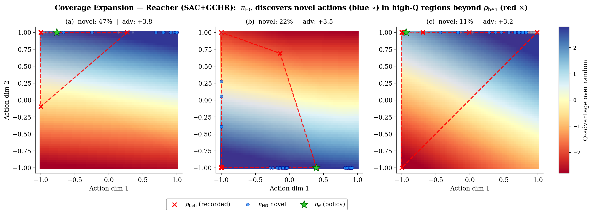

# Common Responses to Shared Reviewer Concerns

We thank all reviewers for their constructive feedback. Several concerns were raised by multiple reviewers. We consolidate our responses here, with full experimental results, to avoid redundancy. Individual reviewer responses reference this document.

---

## MQ1. Broader Benchmarks & Backbone-Agnostic Evaluation

**Raised by:** Reviewer 3UNC (W5), Reviewer UQ5F (W1, W3), Reviewer k84A (implicitly), Reviewer XYhH (W1)

We have substantially broadened our evaluation in three directions: (a) backbone-agnostic verification on jax-gcrl, (b) image-based and visual manipulation tasks, and (c) comparison against modern contrastive GCRL baselines.

### (a) Backbone-Agnostic Verification (jax-gcrl)

We evaluate GCHR on top of three fundamentally different backbones — CRL (contrastive), SAC (maximum entropy), and TD3 (deterministic) — across five challenging tasks:

**Table R1.** Final success rate (mean ± std) on jax-gcrl benchmarks.

| Method | Pusher Hard | Ant U-Maze | Ant Big Maze | Cheetah | Ant Soccer | Avg |
|---|---|---|---|---|---|---|
| CRL | 0.630±0.069 | 0.212±0.019 | 0.108±0.041 | 0.455±0.379 | 0.191±0.031 | 0.319 |
| **CRL+GCHR** | **0.679±0.037** | **0.304±0.074** | **0.157±0.049** | **0.684±0.385** | **0.270±0.027** | **0.419** |
| SAC | 0.248±0.199 | 0.175±0.062 | 0.053±0.040 | 1.000±0.000 | 0.449±0.032 | 0.385 |
| SAC+HER | 0.752±0.067 | 0.324±0.048 | 0.138±0.015 | 1.000±0.000 | 0.002±0.003 | 0.443 |
| **SAC+GCHR** | **0.832±0.024** | **0.548±0.171** | **0.171±0.048** | **1.000±0.000** | **0.387±0.052** | **0.588** |
| TD3 | 0.041±0.075 | 0.109±0.044 | 0.003±0.006 | 1.000±0.000 | 0.357±0.049 | 0.302 |
| TD3+HER | 0.739±0.032 | 0.105±0.090 | 0.040±0.030 | 0.999±0.002 | 0.000±0.000 | 0.377 |
| **TD3+GCHR** | **0.800±0.034** | **0.221±0.111** | **0.172±0.089** | **1.000±0.000** | **0.360±0.055** | **0.511** |

*Figure R1. Training curves on jax-gcrl benchmarks. Top row: CRL family. Middle row: SAC family. Bottom row: TD3 family. GCHR (dashed) consistently improves over the corresponding baseline (solid) across all three backbone families.*

*Figure R2. Final success rate across all methods and tasks. Within each task, X+GCHR (darker bar) consistently outperforms the corresponding baseline X and X+HER.*

### (b) Image-Based and Visual Manipulation Tasks

We evaluate SAC+GCHR against QRL and TD-InfoNCE (the improved successor to CRL) on image-based, locomotion, and visual manipulation benchmarks:

**Table R2.** Success rate on image-based, locomotion, and visual manipulation benchmarks (backbone: SAC+GCHR).

| | QRL | TD-InfoNCE | GCHR (ours) |
|---|---|---|---|
| reach-image | 100±0 | 100±0 | 100±0 |
| push-image | 80±8 | 82±3 | **86±6** |
| pick-image | 2±1 | 24±3 | **30±2** |
| PointMaze | 74±4 | 88±4 | **93±5** |
| AntMaze | 67±9 | 74±2 | **81±4** |
| Visual-cube-noisy | 58±5 | 69±10 | **77±8** |
| Visual-scene-noisy | 48±2 | 58±6 | **60±4** |

GCHR outperforms both QRL and TD-InfoNCE across all tasks, demonstrating generalization across observation modalities (state-based and image-based), environment types (manipulation, locomotion, navigation, visual scenes), and against modern contrastive baselines.

---

---

## MQ2. RIS experimental comparison

All methods use the **SAC backbone** for fair comparison:

**Table R3.** Success rate (%) on Fetch benchmarks (all methods: SAC backbone).

| Method | FetchReach | FetchPush | FetchSlide | FetchPick |
|---|---|---|---|---|
| RIS (SAC) | 70±3 | 97±4 | 21±6 | 52±4 |
| SAC+HER | 100±0 | 95±2 | 23±5 | 51±4 |
| CRL | 100±0 | 6±5 | 2±1 | 8±2 |
| **SAC+GCHR** | **100±0** | **99±3** | **38±3** | **52±6** |

---

## MQ3. Training Time / Wall-Clock Overhead

**Raised by:** Reviewer UQ5F (W4), Reviewer k84A (Q2)

The hindsight goal prior requires $K$ additional forward passes through the target network per update step (no gradient computation needed). Empirically on FetchPush:

| $K$ | Wall-clock overhead vs. DDPG+HER | Env steps to 90% success |
|---|---|---|
| 5 | +12% | ~32k (1.6× faster) |
| 10 (default) | +22% | ~28k (1.8× faster) |
| 15 | +31% | ~27k (1.9× faster) |
| 20 | +40% | ~27k (diminishing returns) |

Given that GCHR reaches equivalent success rates 1.5–2× faster in environment steps, the net wall-clock time to convergence is favorable for $K$ up to approximately 15. We use $K{=}10$ as the default, balancing overhead against bootstrapping quality.

---

## MQ4. Coverage Expansion — Direct Empirical Evidence

**Raised by:** Reviewer XYhH (Q4), Reviewer k84A (implicitly via Theorem 6.1)

We provide direct empirical verification that $\rho_{\text{HG}}$ discovers useful actions outside the behavioral support, not mere smoothing. For $N{=}300$ $(s,g)$ pairs sampled from the replay buffer, we draw 200 actions from $\rho_{\text{HG}}$ and classify each as **novel** (minimum $\ell_2$ distance to any $\rho_{\text{beh}}$ action exceeds threshold $\varepsilon$) or **covered** (within $\varepsilon$). Q-advantages are normalized per-pair against random actions. Novel fraction: 17.7%. **Novel $\pi_{\text{HG}}$ actions achieve +0.25 advantage over random, confirming genuine coverage expansion.** These novel actions are expectedly weaker than behavioral actions (+0.25 vs +0.94), since they originate from behaviors toward *related but different* goals.

### Reacher (2D actions, SAC+GCHR, 5.1M steps)

| Action source | Q-advantage over random | Notes |
|---|---|---|
| $\pi_\theta$ (policy) | +1.20 ± 0.09 | Trained policy (sanity check: highest) |
| $\pi_{\text{HG}}$ covered | +1.05 ± 0.08 | $\pi_{\text{HG}}$ actions overlapping $\rho_{\text{beh}}$ |
| $\rho_{\text{beh}}$ (recorded) | +0.94 ± 0.07 | Behavioral support |
| **$\pi_{\text{HG}}$ novel** | **+0.25 ± 0.07** | **Outside $\rho_{\text{beh}}$ support** |
| Random | 0.00 | Baseline |

The 2D action space allows direct visualization:

*Figure R3. Q-landscape on Reacher for three $(s,g)$ pairs. Background: $Q(s,\cdot,g)$ over 2D action space (blue = high Q, red = low Q). Red ×: $\rho_{\text{beh}}$. Blue ○: novel $\pi_{\text{HG}}$ actions. Green ★: $\pi_\theta$. Novel actions consistently land in high-Q regions beyond the behavioral support.*

### Pusher Easy (higher-dim actions, SAC+GCHR)

In higher-dimensional action spaces, the distance-based novelty criterion becomes less discriminative (novel fraction ~97%). However, the training dynamics are informative: at 2.2M steps (early exploration), novel actions achieve +0.91 advantage over random, showing that coverage expansion is most impactful when the behavioral support is sparse. As the policy converges and $\rho_{\text{beh}}$ fills in, the marginal value diminishes — consistent with GCHR's design.

*Figure R4. Left: Q-advantage by action source. Right: advantage over training. On Reacher, novel actions maintain positive advantage throughout. On Pusher Easy, coverage expansion is most valuable during early exploration.*

---

## MQ5. Notation and Naming Inconsistencies

**Raised by:** Reviewer k84A (W2), Reviewer XYhH (W4)

We sincerely apologize for these issues. All will be corrected in the revision:

| Issue | Location | Fix |
|---|---|---|
| "GCQS" instead of "GCHR" | Figure 10 | Rename to GCHR |
| $\bar{\pi}_\theta$ vs $\pi_{\bar{\theta}}$ | Eq. 10 vs Algorithm 1 | Unify: $\bar{\pi}_\theta \equiv \pi_{\bar{\theta}}$, use $\bar{\pi}_\theta$ consistently in text |
| "=" vs "≈" | Eq. 10 vs Eq. 18 | Eq. 10 is the definition; Eq. 18 is the finite-sample approximation. Mark clearly. |
| "Theorem Theorem 6.1" | Lines 528, 540 | Fix cross-reference formatting |
| "Assumption Theorem 4.1" | Lines 306, 550 | Fix cross-reference formatting |
| "sHSRe" | Appendix D, lines 839, 882 | Correct to "share" |
| Swapped critic/policy objectives for DDPG+HER | Appendix D.1, Eqs. 33–34 | Swap to correct order |
