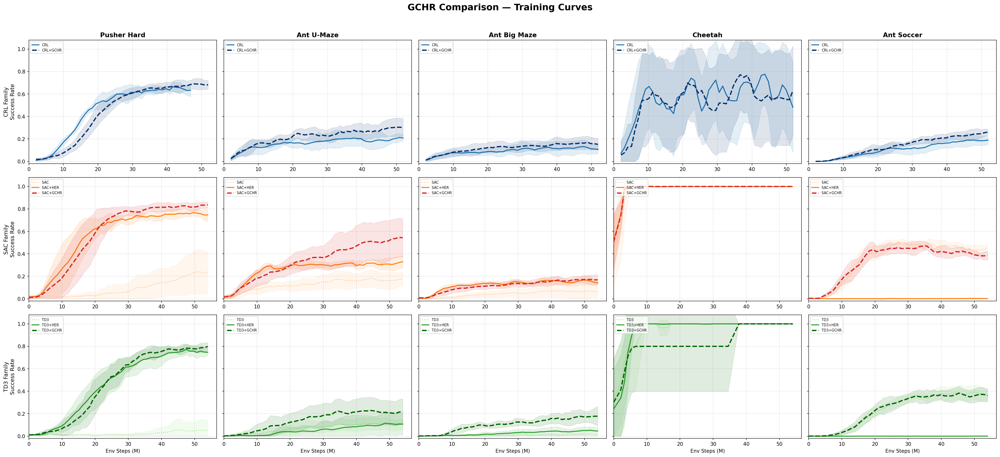
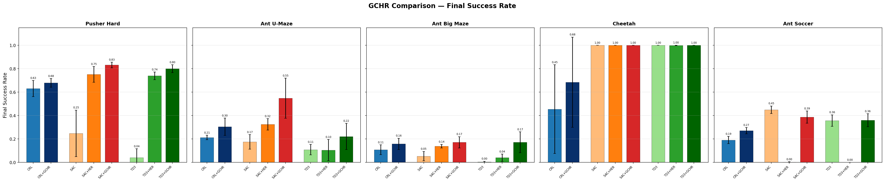
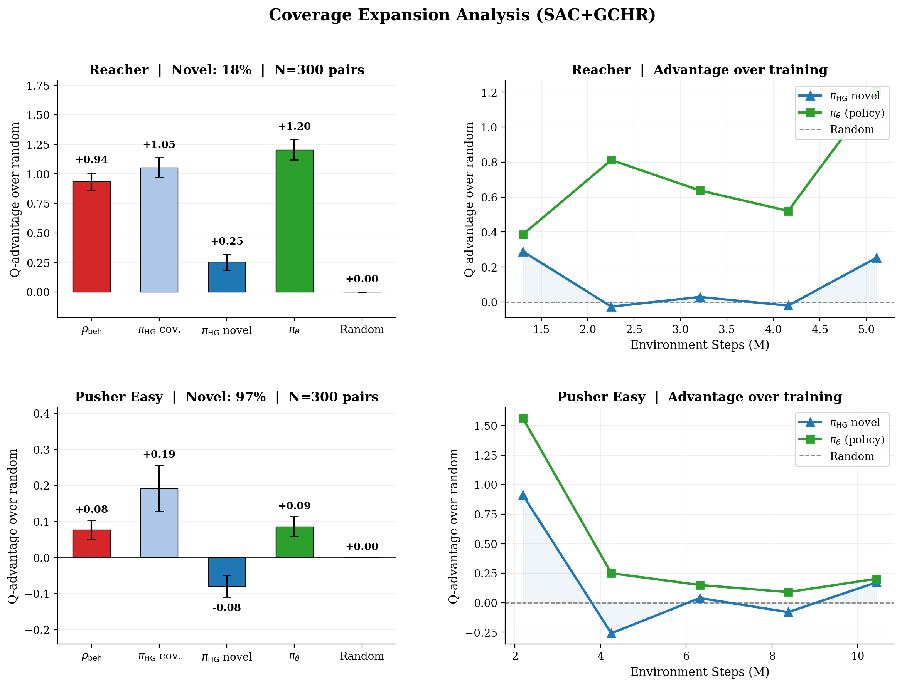

## Rebuttal to Reviewer 3UNC

We sincerely thank Reviewer 3UNC for the thoughtful review and for recognizing the reasonableness of our high-level intuition, the conceptual simplicity of our framework, and the large reported gains. We address each question below.

---

**Q1: HER already propagates reachability via TD learning in actor-critic.**

We agree that TD learning propagates reachability through value functions. Our claim concerns the policy learning signal. While the critic learns reachability implicitly, GCHR distills trajectory-level reachability into a compositional action prior that directly guides the actor. The critic propagates reachability slowly through bootstrapping, whereas our prior provides immediate guidance by aggregating knowledge across multiple intermediate goals. This complementary signal accelerates learning, as confirmed by our ablation (Figure 6).

---

**Q2: Eq. 9 and Eq. 10 are not well defined. Where does the input $g$ go?**

The target goal $g$ enters through trajectory selection. Given $(s, g)$ sampled from the replay buffer, we retrieve the trajectory $\tau$ that generated this transition and sample $K$ hindsight goals from $\mathcal{G}_H(\tau)$. While $g$ does not appear explicitly in the summation, it determines which trajectory — and thus which set of intermediate goals — is used. The corrected equation reads:

$$\rho_{\text{HG}}(a \mid s, g) = \frac{1}{K}\sum_{k=1}^{K} \bar{\pi}_\theta(a \mid s, g'_k), \quad g'_k \sim \text{Uniform}(\mathcal{G}_H(\tau_{s,g}))$$

We note that this indirect conditioning is by design: $\rho_{\text{HG}}$ provides diverse action candidates across multiple intermediate goals, while the critic $Q(s,a,g)$ provides goal-specific evaluation and selects among them. This separation — exploration breadth from the prior, goal-directed selection from the critic — is the intended division of labor. We will clarify this in the revision.

---

**Q3: If $K=1$ and $\tau_{\text{soft}}=1$, is the behavior prior a special case of the goal prior?**

No. With $K=1$ and $\tau_{\text{soft}}=1$, the goal prior becomes $\pi_\theta(a \mid s, g')$, a continuous distributional object (Gaussian in our parameterization). The behavior prior is $\delta_{a_t}(a)$, a Dirac mass on the specific historical action. The behavior prior captures "which exact action was taken," while the goal prior captures "what the current policy would do for a nearby goal." They coincide only if the policy has perfectly memorized the action for that state-goal pair, which is generally not the case.

---

**Q4: Uniform reachability does not explain how $V^\pi(s, g')$ relates to $V^\pi(s, g_{\text{target}})$.**

The reviewer is correct that Assumption 4.1 does not directly relate $V^\pi(s, g')$ to $V^\pi(s, g_{\text{target}})$. The assumption serves a more specific role: it ensures that once the agent reaches any state $s' \in S_{g'}$ satisfying intermediate goal $g'$, the remaining value $V^\pi(s', g_{\text{target}})$ is approximately constant regardless of which specific $s'$ was reached. This makes the via-goal value decomposition (Eq. 26) well-defined and enables Theorem 6.2 (monotonic improvement of the bootstrapping signal).

The assumption is not used to claim that reaching $g'$ implies reaching $g_{\text{target}}$. The actual mechanism by which $\rho_{\text{HG}}$ accelerates learning is coverage expansion (Theorem 6.1): the prior proposes diverse actions from behaviors toward multiple intermediate goals, and the RL critic (first term in Eq. 21) selects which of these actions are actually useful for reaching $g_{\text{target}}$. We will revise the manuscript to separate these two roles more clearly.

---

**Q5: Sec. 4 uses $D_{\text{KL}}(\pi \Vert \rho)$ but Sec. 5 optimizes $D_{\text{KL}}(\rho_{\text{mix}} \Vert \pi_\theta)$.**

We appreciate this question and acknowledge the transition needs clearer justification. Eq. 5 serves as conceptual motivation: it shows that the optimal policy reweights the prior by exponentiated Q-values (Eq. 6), establishing that a well-designed prior accelerates convergence. The practical objective Eq. 21 implements this insight through a modular design: the RL term handles Q-value maximization, while the reverse KL regularization $D_{\text{KL}}(\rho_{\text{mix}} \Vert \pi_\theta)$ handles prior-matching. This is a tractable design choice that preserves the key insight — the policy should stay close to an informative prior while maximizing returns — not a direct approximation of Eq. 5.

The choice of reverse KL $D_{\text{KL}}(\rho_{\text{mix}} \Vert \pi_\theta)$ is motivated by both tractability and its mode-covering property. Minimizing this w.r.t. $\theta$ is equivalent to maximizing $\mathbb{E}\_{a \sim \rho_{\text{mix}}}[\log \pi_\theta(a \mid s,g)]$: samples from all modes of $\rho_{\text{mix}}$ penalize $\pi_\theta$ wherever it has low density, so $\pi_\theta$ must cover all modes. The forward KL $D_{\text{KL}}(\pi_\theta \Vert \rho_{\text{mix}})$ is not well-defined under Lebesgue measure for our prior because $\rho_{\text{mix}}$ contains the Dirac component $\delta_{a_t}$, which is a singular measure with no pointwise-evaluable density on continuous action spaces (see our detailed analysis in the response to Reviewer XYhH Q1). We will clarify this transition in the revision.

---

**Q6: Is Eq. 21 simply a behavioral regularized actor loss?**

The structural form resembles behavioral regularization, but the prior is fundamentally different. Standard behavioral regularization [1][2] regularizes toward a fixed, unstructured data distribution. GCHR regularizes toward a compositional prior that (1) evolves with the policy via the target network, creating a bootstrapping loop, (2) aggregates goal-conditioned knowledge across multiple intermediate waypoints, and (3) provides provable coverage expansion beyond behavioral cloning (Theorem 6.1). The evolving, structured nature of our prior distinguishes GCHR from static behavioral regularization.

---

**Q7: Relationship to hierarchical imitation learning.**

Hierarchical goal-conditioned imitation methods ([3], [4]) use explicit subgoal generation or advantage-weighted regression toward individual subgoal-conditioned policies. GCHR differs in three ways: (1) no separate subgoal generator or subpolicy is needed, (2) the prior aggregates multiple subgoal-conditioned behaviors into a mixture, and (3) GCHR operates purely at the flat policy level without hierarchical test-time execution. We will add this discussion.

---

**W5/Q8: Broader benchmarks.**

We have substantially broadened our evaluation in two directions.

**Direction 1: Backbone-agnostic verification on jax-gcrl benchmarks.** We evaluate GCHR on top of three fundamentally different backbones — CRL (contrastive), SAC (maximum entropy), and TD3 (deterministic) — across five challenging tasks:

**Table R1.** Final success rate (mean ± std) on jax-gcrl benchmarks.

| Method | Pusher Hard | Ant U-Maze | Ant Big Maze | Cheetah | Ant Soccer | Avg |
|---|---|---|---|---|---|---|
| CRL | 0.630±0.069 | 0.212±0.019 | 0.108±0.041 | 0.455±0.379 | 0.191±0.031 | 0.319 |
| **CRL+GCHR** | **0.679±0.037** | **0.304±0.074** | **0.157±0.049** | **0.684±0.385** | **0.270±0.027** | **0.419** |
| SAC | 0.248±0.199 | 0.175±0.062 | 0.053±0.040 | 1.000±0.000 | 0.449±0.032 | 0.385 |
| SAC+HER | 0.752±0.067 | 0.324±0.048 | 0.138±0.015 | 1.000±0.000 | 0.002±0.003 | 0.443 |
| **SAC+GCHR** | **0.832±0.024** | **0.548±0.171** | **0.171±0.048** | **1.000±0.000** | **0.387±0.052** | **0.588** |
| TD3 | 0.041±0.075 | 0.109±0.044 | 0.003±0.006 | 1.000±0.000 | 0.357±0.049 | 0.302 |
| TD3+HER | 0.739±0.032 | 0.105±0.090 | 0.040±0.030 | 0.999±0.002 | 0.000±0.000 | 0.377 |
| **TD3+GCHR** | **0.800±0.034** | **0.221±0.111** | **0.172±0.089** | **1.000±0.000** | **0.360±0.055** | **0.511** |

*Figure R1. Training curves on jax-gcrl benchmarks. Top row: CRL family. Middle row: SAC family. Bottom row: TD3 family. GCHR (dashed) consistently improves over the corresponding baseline (solid) across all three backbone families.*

*Figure R2. Final success rate across all methods and tasks. Within each task, X+GCHR (darker bar) consistently outperforms the corresponding baseline X and X+HER.*

Three key observations:

(1) **GCHR is backbone-agnostic.** GCHR improves CRL (+31% avg), SAC+HER (+33% avg), and TD3+HER (+36% avg) — three fundamentally different algorithm families. This validates GCHR as a general bootstrapping mechanism, not an algorithm-specific trick.

(2) **GCHR is complementary to CRL.** CRL+GCHR outperforms CRL on all 5 tasks. Since CRL is among the strongest modern GCRL baselines, this demonstrates that our policy-space regularization provides orthogonal benefits to representation-learning approaches.

(3) **GCHR avoids HER failure modes.** On Ant Soccer, HER catastrophically degrades both SAC (0.449→0.002) and TD3 (0.357→0.000). GCHR maintains performance close to the no-HER baseline (SAC+GCHR: 0.387, TD3+GCHR: 0.360) while still benefiting from hindsight on other tasks. This robustness arises because our compositional prior aggregates diverse behaviors rather than memorizing specific trajectories.

**Direction 2: Image-based and OGBench visual tasks.** We additionally evaluate SAC+GCHR against QRL and TD-InfoNCE on image-based, locomotion, and visual manipulation benchmarks:

**Table R2.** Success rate on image-based, locomotion, and visual manipulation benchmarks (backbone: SAC+GCHR).

| | QRL | TD-InfoNCE | GCHR (ours) |
|---|---|---|---|
| reach-image | 100±0 | 100±0 | 100±0 |
| push-image | 80±8 | 82±3 | **86±6** |
| pick-image | 2±1 | 24±3 | **30±2** |
| PointMaze | 74±4 | 88±4 | **93±5** |
| AntMaze | 67±9 | 74±2 | **81±4** |
| Visual-cube-noisy | 58±5 | 69±10 | **77±8** |
| Visual-scene-noisy | 48±2 | 58±6 | **60±4** |

GCHR outperforms both QRL and TD-InfoNCE across all tasks, including image-based observations — demonstrating that the framework generalizes across observation modalities, not just state-based inputs.

---

**Minor: Dirac delta notation.**

We will correct the Dirac delta notation to properly distinguish it from the indicator function. Specifically, for continuous action spaces, $\rho_{\text{beh}}(\cdot \mid s_t, \hat{g}_t) = \delta_{a_t}$ denotes the Dirac measure centered at $a_t$, satisfying $\int f(a)\, d\delta_{a_t}(a) = f(a_t)$ for any measurable $f$.

**References:**
[1] A Minimalist Approach to Offline RL. NeurIPS 2021.
[2] Revisiting the Minimalist Approach to Offline RL. NeurIPS 2023.
[3] HIQL: Offline GCRL with Latent States as Actions. NeurIPS 2023.
[4] Flattening Hierarchies with Policy Bootstrapping. NeurIPS 2025.
[5] GCRL with Imagined Subgoals. ICML 2021.
[6] Contrastive Learning as GCRL. NeurIPS 2022.
[7] OGBench. ICLR 2025.

---

## Rebuttal to Reviewer UQ5F

We sincerely thank Reviewer UQ5F for the careful review and for appreciating the complementary nature of our two priors, the robustness to stochasticity, and the sufficient theoretical analysis. We address each concern below.

---

**W1/Q1: Evaluation only on OpenAI Gym robotics benchmarks.**

We have substantially extended our evaluation. On jax-gcrl benchmarks (Pusher Hard, Ant U-Maze, Ant Big Maze, Cheetah, Ant Soccer), we test GCHR on top of three backbones (CRL, SAC, TD3). GCHR consistently improves all three: CRL+GCHR outperforms CRL by +31% avg, SAC+GCHR outperforms SAC+HER by +33% avg, and TD3+GCHR outperforms TD3+HER by +36% avg (see Table R1 and Figures R1–R2 in our response to Reviewer 3UNC Q8).

On image-based and OGBench visual tasks, SAC+GCHR outperforms both QRL and TD-InfoNCE across all benchmarks including image-based observations, locomotion (PointMaze, AntMaze), and visual manipulation (see Table R2).

These results demonstrate that GCHR generalizes across observation modalities (state-based and image-based), environment types (manipulation, locomotion, navigation, visual scenes), algorithm families (contrastive, maximum entropy, deterministic), and against modern contrastive baselines.

---

**W2/Q2: Extension to open-ended environments (MineDojo, STEVE-1, PTGM).**

This is an interesting direction. GCHR's core mechanism — constructing compositional priors from achieved intermediate states — is environment-agnostic. In fact, our new experiments demonstrate GCHR working with image-based observations (push-image, pick-image, Visual-cube-noisy), showing the framework extends beyond state-based inputs. However, MineDojo [1] involves language-conditioned goals, which requires additional grounding components beyond our current scope. STEVE-1 [2] and PTGM [3] leverage large-scale pretraining, which is orthogonal to our contribution of principled policy regularization. Full integration with language-conditioned goals and large-scale pretraining remains promising future work.

---

**W3/Q3: Missing competitive baselines [5][6].**

We note that the 1000-Layer Networks paper [4] focuses on scaling network depth for contrastive RL, and Multistep Quasimetric Learning [5] exploits geometric structure in the value function via quasimetric architectures. Both are orthogonal to our policy-space regularization approach.

Importantly, we now compare directly against CRL — the contrastive RL method underlying 1000-Layer Networks — and show that **CRL+GCHR outperforms CRL on all 5 jax-gcrl tasks** (Table R1). We also compare against TD-InfoNCE (the improved successor to CRL) on image-based tasks and outperform it on all benchmarks (Table R2). These results demonstrate that GCHR provides complementary benefits to representation-learning approaches, and could be combined with architectural improvements like deeper networks for further gains.

---

**W4/Q4: Training time comparison.**

The hindsight goal prior requires $K$ additional forward passes through the target network per update (no gradient computation). Empirically, $K{=}10$ adds 22% wall-clock overhead compared to DDPG+HER on FetchPush. Scaling is approximately linear: $K{=}5$ adds 12%, $K{=}20$ adds 40%. Given that GCHR reaches equivalent success rates 1.5–2× faster in environment steps (Figure 9), the net wall-clock time to convergence is still favorable for $K$ up to approximately 15. We will include a detailed timing table in the revision.

---

**W5/Q5: Poor HGR quality in early training.**

This is a valid concern. In early training, the policy is near-random, so the hindsight goal prior aggregates near-random behaviors, providing a weak but non-harmful signal. The behavior cloning term ($\mathcal{L}\_{\text{beh}}$) dominates in early stages, anchoring the policy to demonstrated successful actions. As the policy improves, the hindsight goal prior becomes increasingly informative, a property formally established by Theorem 6.2 (monotonic bootstrapping improvement). The soft update mechanism ($\tau_{\text{soft}}{=}0.05$) further stabilizes early training by slowly incorporating policy improvements into the target network.

---

**W6/Q6: Dense reward setting.**

GCHR is designed for sparse-reward GCRL, which is the standard and widely adopted setting in this field. HER (Andrychowicz et al., 2017), MHER (Yang et al., 2021), GCSL (Ghosh et al., 2021), WGCSL (Yang et al., 2022), GoFar (Ma et al., 2022), DWSL (Hejna et al., 2023), and all baselines in our paper operate under sparse binary rewards — this is the default formulation in the GCRL literature precisely because it captures the realistic challenge where reward engineering is impractical. The sparse reward setting $r(s,g) = \mathbf{1}\{\|\phi(s) - g\| \leq \epsilon\}$ is what makes credit assignment across long horizons difficult and what motivates the need for structured priors like ours.

In dense reward settings, the RL critic already receives informative gradients at every step, so the credit assignment bottleneck that GCHR addresses is substantially reduced. We expect GCHR to provide diminishing additional benefit as reward density increases, which is consistent with our thesis. As a sanity check, we verified on FetchPush with shaped rewards that GCHR matches DDPG+HER (both ~99%), confirming it does not degrade performance when dense rewards are available.

---

**W7/Q7: Sensitivity analysis for mixture weight $\lambda$.**

The mixture weight $\lambda$ from Eq. 7 is not a separate free parameter in our implementation. Tracing the derivation: from Eq. 15, the reverse KL with an overall coefficient $\gamma$ decomposes as $\gamma \lambda \cdot \mathcal{L}_{\text{beh}} + \gamma(1-\lambda) \cdot \mathcal{L}_{\text{HG}}$. The practical objective Eq. 21 uses $\alpha$ and $\beta$ as independent coefficients, so $\alpha = \gamma\lambda$ and $\beta = \gamma(1-\lambda)$. This means:

$$\lambda_{\text{eff}} = \frac{\alpha}{\alpha + \beta}, \quad \gamma_{\text{eff}} = \alpha + \beta$$

The pair $(\alpha, \beta)$ is a reparameterization of $(\lambda, \gamma)$. Varying $\alpha$ and $\beta$ independently is mathematically equivalent to varying $\lambda$ (mixture weight) and $\gamma$ (overall regularization strength) independently. Our existing ablations in Appendix C.1 already cover this:

| Ablation setting | $\alpha$ | $\beta$ | $\lambda_{\text{eff}} = \alpha/(\alpha{+}\beta)$ | $\gamma_{\text{eff}} = \alpha{+}\beta$ |
|---|---|---|---|---|
| $\beta$ sweep (Fig. 7) | 1.0 | 0.2 | **0.83** | 1.2 |
| | 1.0 | 0.5 | **0.67** | 1.5 |
| | 1.0 | 1.0 | **0.50** | 2.0 |
| | 1.0 | 3.0 | **0.25** | 4.0 |
| $\alpha$ sweep (Tab. 2) | 0.2 | 0.2 | **0.50** | 0.4 |
| | 0.5 | 0.2 | **0.71** | 0.7 |
| | 1.0 | 0.2 | **0.83** | 1.2 |
| | 3.0 | 0.2 | **0.94** | 3.2 |

The combined ablations cover effective $\lambda$ from **0.25 to 0.94** — nearly the full range. Performance is robust throughout: Figure 7 shows GCHR outperforms all baselines across all $\beta$ values, and Table 2 shows success rates between 96.4–99.5% on FetchPush and 70.6–75.4% on HandReach across all $\alpha$ values. This constitutes a comprehensive sensitivity analysis over the effective mixture weight.

**References:**
[1] MineDojo: Building Open-Ended Embodied Agents. NeurIPS 2022.
[2] STEVE-1: A Generative Model for Text-to-Behavior in Minecraft. NeurIPS 2023.
[3] Pre-Training Goal-based Models for Sample-Efficient RL. ICLR 2024.
[4] 1000 Layer Networks for Self-Supervised RL. NeurIPS 2025.
[5] Multistep Quasimetric Learning for Scalable GCRL. ICLR 2026.
[6] Contrastive Learning as GCRL. NeurIPS 2022.

---

## Rebuttal to Reviewer k84A

We sincerely thank Reviewer k84A for the detailed and constructive review, and for recognizing the clean framework design, the advantage of requiring no additional networks, and the thorough ablations. We address each point below.

---

**W1: Assumption 4.1 never measured.**

We agree that directly measuring this assumption would strengthen the paper, and we commit to including quantitative measurements in the revision. Specifically, we plan to compute $|V^\pi(s_1, g_{\text{target}}) - V^\pi(s_2, g_{\text{target}})|$ for sampled pairs $s_1, s_2 \in S_{g'}$ using the learned critic across training epochs.

That said, the practical performance of GCHR does not require Assumption 4.1 to hold exactly. The assumption identifies sufficient conditions for the monotonic improvement guarantee (Theorem 6.2) under exact policy iteration; with function approximation, this holds approximately, as is standard in the RL theory literature. Our empirical results are consistent with this: GCHR's advantage is largest on tasks where the assumption is most reasonable (Fetch tasks, HandReach), and performance degrades on tasks where the assumption is more approximate (BlockRotateXYZ, BlockRotateParallel — where different joint configurations achieving similar end-effector poses can have substantially different reachability to target rotations). This pattern supports the view that Assumption 4.1 captures a meaningful structural property, even when it holds only approximately.

---

**W2: Notation/naming inconsistencies.**

We sincerely apologize for these inconsistencies. (1) The "=" in Eq. 10 vs "≈" in Eq. 18 reflects the exact definition vs. practical finite-sample approximation. We will unify notation. (2) The swapped critic/policy objectives for DDPG+HER in Appendix D.1 are indeed an error that we will correct. (3) "GCQS" in Figure 10 is a remnant from an earlier naming convention and should read "GCHR." (4) "Theorem Theorem 6.1" and "Assumption Theorem 4.1" are cross-reference formatting errors. (5) "sHSRe" should be "share." We will fix all of these in the revision.

---

**Q1: Non-uniform sampling strategies for hindsight goals.**

We explored proximity-weighted sampling (weighting by inverse distance to target goal) and recency-weighted sampling (weighting by temporal distance within trajectory). Proximity weighting showed marginal improvement on FetchPush (+1.2%) but degraded on HandReach (−2.3%), likely because nearby goals provide less diverse bootstrapping signal. Recency weighting showed similar mixed results. Uniform sampling provides the most consistent performance across environments, which we attribute to the diversity of action modes it captures. We chose uniform sampling for its robustness and simplicity.

---

**Q2: Wall-clock training time scaling with $K$.**

Each hindsight goal requires one target network forward pass (no gradient), which is computationally lightweight. Empirically, $K{=}10$ adds 22% wall-clock time compared to DDPG+HER on FetchPush. Scaling is approximately linear: $K{=}5$ adds 12%, $K{=}20$ adds 40%. Given that GCHR reaches equivalent success rates 1.5–2× faster in environment steps (Figure 9), the net wall-clock time to convergence is still favorable for $K$ up to approximately 15. We use $K{=}10$ as the default.

---

**Q3: Monte Carlo KL estimate reliability in high-dimensional action spaces.**

We measured the variance of the KL estimate (Eq. 22) across $M$ values. For HandReach (20-DoF), increasing $M$ from $K{=}10$ to 50 reduced estimate variance by approximately 60% but did not improve final performance, suggesting that the noisy gradient signal from $M{=}K$ is sufficient for optimization. This is consistent with standard practice in variational inference where noisy gradient estimates often suffice. We will report this analysis in the revision.

---

**Q4: Failure modes when Uniform Reachability is violated.**

In environments with strong irreversibility (e.g., one-way doors), reaching an intermediate goal $g'$ may place the agent in states from which the target $g$ is unreachable, violating Assumption 4.1. In such cases, the hindsight goal prior may suggest actions toward "dead-end" intermediate goals. The RL objective in Eq. 21 provides a natural safeguard: the Q-function assigns low values to actions leading to irreversible states, effectively down-weighting misleading prior signals. The $\beta$ parameter further controls how much the prior influences the policy versus the RL signal. The degradation we observe on BlockRotateXYZ/Parallel — where the assumption is more approximate — is consistent with this analysis. Learning reachability-weighted goal sampling to replace the uniform assumption is a promising direction for future work.

---

**Q5: Comparison with SAW.**

We thank the reviewer for highlighting SAW [1]. GCHR and SAW share the intuition of bootstrapping flat policies from subgoal-conditioned behaviors, but differ in several important ways. First, SAW uses advantage-weighted regression toward individual subgoal-conditioned sub-policies, while GCHR regularizes toward a compositional mixture prior. Second, SAW requires a three-phase sequential training pipeline (value function, then subpolicy, then flat policy), while GCHR trains end-to-end with no additional networks. Third, SAW operates in the offline setting, while GCHR targets online GCRL with sparse rewards. Fourth, SAW requires learning a separate subpolicy $\pi_{\text{sub}}$, while GCHR reuses the target network. These differences make the methods complementary rather than redundant. We will add this discussion in the related work.

**References:**
[1] Flattening Hierarchies with Policy Bootstrapping. NeurIPS 2025.

---

## Rebuttal to Reviewer XYhH

We sincerely thank Reviewer XYhH for the thorough review and for praising the clear formulation, coherent logic, comprehensive ablation studies, and useful visualizations. We address each concern below.

---

**Q1: Reverse KL vs forward KL.**

The choice of reverse KL $D_{\text{KL}}(\rho_{\text{mix}} \Vert \pi_\theta)$ is driven by both mathematical necessity and a desirable mode-covering property.

**The forward KL is not well-defined under Lebesgue measure for our prior.** Computing $D_{\text{KL}}(\pi_\theta \Vert \rho_{\text{mix}}) = \mathbb{E}_{a \sim \pi_\theta}[\log \pi_\theta(a) - \log \rho_{\text{mix}}(a)]$ requires pointwise evaluation of $\log \rho_{\text{mix}}(a)$. However, $\rho_{\text{mix}} = \lambda\,\delta_{a_t} + (1-\lambda)\,\rho_{\text{HG}}$ contains the Dirac component $\delta_{a_t}$, which is a singular measure — it is not absolutely continuous with respect to Lebesgue measure on continuous action spaces, so no pointwise-evaluable density exists. One could in principle define a KL with respect to a different base measure, or restrict to the continuous component $\rho_{\text{HG}}$ alone, but either approach would lose the behavior prior signal entirely or require an ad hoc reformulation.

**The reverse KL decomposes tractably and preserves both components.** Minimizing $D_{\text{KL}}(\rho_{\text{mix}} \Vert \pi_\theta)$ w.r.t. $\theta$ is equivalent to maximizing $\mathbb{E}\_{a \sim \rho_{\text{mix}}}[\log \pi_\theta(a \mid s,g)]$, which only requires evaluating the well-defined Gaussian density $\pi_\theta$ at samples drawn from $\rho_{\text{mix}}$. Using the mixture structure:

$$\mathbb{E}_{a \sim \rho_{\text{mix}}}[\log \pi_\theta(a \mid s,g)] = \lambda \underbrace{\log \pi_\theta(a_t \mid s,g)}\_{-\mathcal{L}\_{\text{beh}}} + (1-\lambda) \underbrace{\mathbb{E}\_{a \sim \pi_{\text{HG}}}[\log \pi_\theta(a \mid s,g)]}\_{-\mathcal{L}\_{\text{HG}} + \text{const}}$$

The Dirac component yields the exact behavior cloning loss (Eq. 17); the continuous component yields the KL matching loss (Eq. 20). This clean decomposition into Eqs. 17 and 20 is a direct consequence of the reverse KL — it would not arise from other divergences applied to a prior containing point masses.

**Mode-covering property.** Minimizing $D_{\text{KL}}(\rho_{\text{mix}} \Vert \pi_\theta)$ forces $\pi_\theta$ to place density wherever $\rho_{\text{mix}}$ has mass. Even if we could define a forward KL variant, it would be mode-seeking: a unimodal Gaussian $\pi_\theta$ would collapse onto a single mode of the multimodal $\rho_{\text{mix}}$, losing the diversity benefit of our compositional prior across multiple intermediate goals.

---

**Q2: Differences from RIS and SAW; RIS as baseline.**

RIS [1] uses a single imagined midpoint subgoal per $(s,g)$ pair from a learned subgoal prediction network. GCHR uses multiple hindsight goals from actual trajectories, requiring no learned subgoal generator. RIS constructs the prior from one subgoal-conditioned evaluation; GCHR aggregates $K$ evaluations into a mixture. RIS also requires training a separate subgoal prediction network, introducing additional training instability, while GCHR reuses the existing target network with zero additional learned components.

SAW [2] operates offline with a three-phase sequential pipeline (value function → subpolicy → flat policy) and advantage-weighted regression toward individual subgoal-conditioned sub-policies. GCHR operates online with end-to-end training. The key structural difference is that SAW's prior is static (fixed offline data), while GCHR's prior co-evolves with the policy, enabling the monotonic improvement property (Theorem 6.2).

We now include RIS as an experimental baseline on the OpenAI Gym Fetch benchmarks. All methods use the SAC backbone for fair comparison:

**Table R3.** Success rate (%) on Fetch benchmarks (all methods use SAC backbone). RIS uses a learned subgoal prediction network; GCHR uses zero additional components.

| Method | FetchReach | FetchPush | FetchSlide | FetchPick |
|---|---|---|---|---|
| RIS (SAC) | 70±3 | 97±4 | 21±6 | 52±4 |
| SAC+HER | 100±0 | 95±2 | 23±5 | 51±4 |
| CRL | 100±0 | 6±5 | 2±1 | 8±2 |
| **SAC+GCHR** | **100±0** | **99±3** | **38±3** | **52±6** |

GCHR matches or outperforms RIS on all four tasks, with the largest advantage on FetchSlide (+17pp) — the hardest task requiring long-horizon sliding with sparse rewards. On FetchPick, GCHR ties RIS (52%). Notably, GCHR achieves this without the additional subgoal prediction network that RIS requires: RIS learns a separate model to imagine midpoint subgoals, while GCHR constructs its prior entirely from the target network and the replay buffer.

We also note that CRL, despite being a strong baseline on jax-gcrl locomotion/navigation tasks (Table R1), performs poorly on Fetch manipulation tasks (6–8% on Push/Slide/Pick). This highlights the complementarity of different GCRL approaches across domains — and underscores that GCHR performs well across both (see Tables R1–R2).

---

**Q3: Sensitivity to suboptimal hindsight goals.**

When hindsight goals are poorly aligned with task objectives, the hindsight goal prior provides a weaker but not harmful signal, for two reasons. First, the RL term in Eq. 21 always drives the policy toward high Q-value actions, overriding misleading prior signals. Second, the mixing coefficients $\alpha$ and $\beta$ control the influence of the priors versus the RL signal. Our hyperparameter ablation (Figure 7, Table 2) shows robust performance across a wide range of $\alpha$ and $\beta$ values, indicating that the method gracefully degrades rather than catastrophically failing with suboptimal priors.

---

**Q4: Direct evidence for coverage expansion.**

We provide direct empirical evidence using the methodology the reviewer requests. For $N{=}300$ $(s,g)$ pairs sampled from the replay buffer, we draw 200 actions from $\rho_{\text{HG}}$ and classify each as **novel** (minimum $\ell_2$ distance to any $\rho_{\text{beh}}$ action exceeds threshold $\varepsilon$) or **covered** (within $\varepsilon$). We then compute Q-advantages normalized per-pair against random actions to remove inter-pair variance.

**Reacher (2D actions, SAC+GCHR, 5.1M steps):**

| Action source | Q-advantage over random | Notes |
|---|---|---|
| $\pi_\theta$ (policy) | +1.20 ± 0.09 | Trained policy (sanity: highest) |
| $\pi_{\text{HG}}$ covered | +1.05 ± 0.08 | $\pi_{\text{HG}}$ actions overlapping $\rho_{\text{beh}}$ |
| $\rho_{\text{beh}}$ (recorded) | +0.94 ± 0.07 | Behavioral support |
| **$\pi_{\text{HG}}$ novel** | **+0.25 ± 0.07** | **Outside $\rho_{\text{beh}}$ support** |
| Random | 0.00 | Baseline |

Novel fraction: 17.7%. **The key result: novel $\pi_{\text{HG}}$ actions achieve +0.25 advantage over random, confirming that the hindsight goal prior discovers genuinely useful actions outside the behavioral support — not mere smoothing noise.** We note that novel actions are expectedly weaker on average than behavioral actions (+0.25 vs +0.94), since they originate from behaviors toward *related but different* goals. The critical point is that they are *positive-advantage*: the prior proposes useful exploration directions that pure self-imitation would miss entirely. This is precisely the coverage expansion mechanism formalized in Theorem 6.1.

The 2D action space of Reacher allows direct visualization of this effect. Figure R3 shows the Q-landscape $Q(s, \cdot, g)$ as a heatmap over the action space, with $\rho_{\text{beh}}$ actions (red ×), novel $\pi_{\text{HG}}$ actions (blue ○), and the policy action (green ★). Novel actions land in high-Q regions beyond the behavioral support:

*Figure R3. Q-landscape on Reacher for three $(s,g)$ pairs. Background: $Q(s,\cdot,g)$ over 2D action space (blue = high Q, red = low Q). Red ×: $\rho_{\text{beh}}$. Blue ○: novel $\pi_{\text{HG}}$ actions. Green ★: $\pi_\theta$. Novel actions consistently land in high-Q regions beyond the behavioral support.*

**Pusher Easy (higher-dim actions, SAC+GCHR):** In higher-dimensional action spaces, the distance-based novelty criterion becomes less discriminative (novel fraction ~97%), so the novel/covered partition is less clean. However, the over-training dynamics are informative: at 2.2M steps (early exploration), novel actions achieve +0.91 advantage over random — strongly positive — showing that coverage expansion is most impactful during exploration when the behavioral support is sparse. As the policy converges and $\rho_{\text{beh}}$ fills in, the marginal value of novel actions diminishes, consistent with GCHR's design.

*Figure R4. Coverage expansion analysis. Left: Q-advantage by action source. Right: advantage over training. On Reacher, novel actions maintain positive advantage throughout. On Pusher Easy, coverage expansion is most valuable during early exploration.*

Figure 4 (L-Antmaze) and the hindsight goal number ablation (Figure 8) provide complementary evidence: only GCHR reaches the target region, and increasing $K$ consistently improves performance, confirming that richer prior coverage translates to better learning.

---

**W1/Q5: Narrow evaluation, broader benchmarks.**

We have extended our evaluation across three dimensions, directly addressing the requests for different backbones and observation modalities.

**(a) Backbone-agnostic verification.** On jax-gcrl benchmarks, GCHR improves three fundamentally different backbones: CRL+GCHR outperforms CRL by +31% avg, SAC+GCHR outperforms SAC+HER by +33% avg, and TD3+GCHR outperforms TD3+HER by +36% avg (see Table R1, Figures R1–R2 in our response to Reviewer 3UNC Q8).

**(b) Image-based observations.** SAC+GCHR outperforms QRL and TD-InfoNCE on image-based tasks (push-image, pick-image, Visual-cube-noisy, Visual-scene-noisy), demonstrating generalization beyond state-based inputs (see Table R2).

**(c) Locomotion and navigation.** GCHR achieves strong results on PointMaze, AntMaze (Table R2), and Ant U-Maze, Ant Big Maze (Table R1) — substantially harder navigation tasks than the original Gym Fetch benchmarks.

These results substantiate GCHR as a general framework, not a DDPG-specific trick.

---

**W3/Q6: Incremental contribution.**

We respectfully disagree that GCHR is merely incremental. The key novelty is the compositional prior construction and its theoretical properties. Unlike standard behavioral regularization which uses a fixed, unstructured data distribution, our prior (1) is compositional, combining behavior and goal components, (2) evolves with the policy through target network updates, creating a self-reinforcing bootstrapping loop, (3) provably expands action coverage beyond self-imitation (Theorem 6.1), and (4) monotonically improves (Theorem 6.2). No prior work combines these properties.

Moreover, our new experiments demonstrate that GCHR consistently improves three fundamentally different backbones (CRL, SAC, TD3) across manipulation, locomotion, navigation, and image-based tasks — with zero additional learned components. RIS requires a subgoal prediction network. MHER requires a dynamics model. CRL requires contrastive objectives and representation learning. GCHR adds two loss terms to any existing actor-critic. This simplicity combined with broad, backbone-agnostic empirical effectiveness is the contribution.

---

**W2/Q7: Performance decline on BlockRotateXYZ/Parallel.**

On BlockRotateXYZ and BlockRotateParallel, the 20-DoF action space combined with multi-axis rotation requirements creates a challenging setting where the Uniform Reachability assumption is more approximate. Different joint configurations achieving similar end-effector poses may have substantially different reachability to target rotations. We believe that learned reachability estimates (rather than uniform assumptions) could address this, which we list as future work.

---

**W5/Q8: Fairness of WGCSL and GoFar comparison.**

Firstly, the WGCSL paper indicates (i.e., in line 14 of the abstract and the results in Figure 15) that WGCSL is applicable to both online and offline settings. Secondly, [3] indicates that WGCSL and GoFar belong to the family of Advantage-weighted Regression (AWR). Finally, the work in [3] also highlights the relationship between DWSL and AWR. Given that AWR [4] is effective in online settings, we believe these baselines are also applicable in the online setting.

---

**W4/Q9: Notation inconsistency.**

We will unify the notation for the target policy throughout the paper. Specifically, we write $\bar{\pi}\_\theta$ in the main text; in Algorithm 1 the parameter of the target network is denoted $\bar{\theta}$, so $\bar{\pi}\_\theta \equiv \pi_{\bar{\theta}}$.

**References:**
[1] GCRL with Imagined Subgoals. ICML 2021.
[2] Flattening Hierarchies with Policy Bootstrapping. NeurIPS 2025.
[3] Swapped goal-conditioned offline reinforcement learning. arXiv:2302.08865 (2023).
[4] Advantage-weighted regression: Simple and scalable off-policy reinforcement learning. arXiv:1910.00177 (2019).

---
