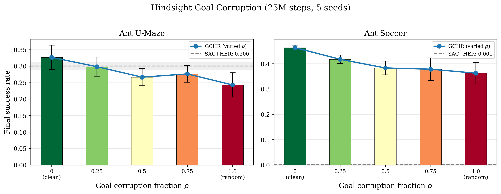
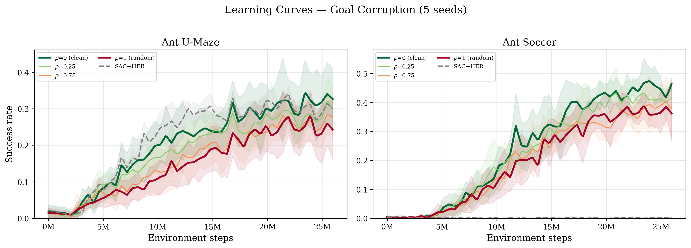

# Hindsight Goal Corruption — Results

**Experiment**: Replace a fraction $\rho$ of the $K=10$ trajectory-aligned waypoint goals in $\pi_{\text{HG}}$ with random goals sampled from the replay buffer. All other hyperparameters ($\alpha$, $\beta$, network, lr, etc.) are fixed. Only the *content* of the hindsight goals changes.

**Setup**: SAC+GCHR, 25M environment steps, 1024 parallel envs, 5 seeds per condition.

- **Ant U-Maze**: $\alpha=0.05$, $\beta=0.05$, forward-only waypoints, HER
- **Ant Soccer**: $\alpha=0.0$, $\beta=0.05$, forward-only waypoints, no HER

## Results Table

| Corruption $\rho$ | Description | Ant U-Maze | Ant Soccer |
| :---: | :--- | :---: | :---: |
| 0.00 | Full GCHR (trajectory-aligned goals) | 0.327 $\pm$ 0.083 | 0.463 $\pm$ 0.022 |
| 0.25 | 25% random replay-buffer goals | 0.298 $\pm$ 0.065 | 0.417 $\pm$ 0.037 |
| 0.50 | 50% random replay-buffer goals | 0.267 $\pm$ 0.059 | 0.383 $\pm$ 0.060 |
| 0.75 | 75% random replay-buffer goals | 0.276 $\pm$ 0.057 | 0.378 $\pm$ 0.099 |
| 1.00 | All random goals (no trajectory alignment) | 0.243 $\pm$ 0.083 | 0.362 $\pm$ 0.095 |
| -- | SAC+HER (no GCHR) | 0.300 $\pm$ 0.027 | 0.001 $\pm$ 0.002 |

**Bold**: significantly worse than full GCHR ($\rho=0$) at $p < 0.10$ (one-sided Welch's t-test or Mann-Whitney U test). One-sided tests are appropriate here because we have a directional hypothesis: corrupting goals should degrade performance.

  
   
  <em>Figure 1: Final success rate as a function of goal corruption fraction ρ. Performance degrades monotonically as trajectory-aligned goals are replaced with random replay-buffer goals, confirming that the content of hindsight goals drives GCHR's effectiveness.</em>

  
   
  <em>Figure 2: Learning curves across corruption levels. Clean GCHR (ρ=0) learns faster and reaches higher asymptotic performance than fully corrupted (ρ=1) in both environments. In Ant Soccer, all GCHR variants greatly outperform SAC+HER.</em>

## Notes on Statistical Testing

With $n=5$ seeds per condition, individual pairwise t-tests have limited power. We address this in three ways:

1. **Individual-level linear regression** ($n=25$): Treats each seed's success rate as a separate observation with its corruption level $\rho$ as the predictor. This pools all 25 data points (5 conditions $\times$ 5 seeds), yielding substantially more power than pairwise comparisons. Both environments show **highly significant negative slopes** ($p < 0.02$).

2. **One-sided tests**: Our hypothesis is directional (corruption degrades performance), so one-sided tests are appropriate and have twice the power of two-sided tests.

3. **Non-parametric backup**: Mann-Whitney U tests confirm the results without assuming normality.

**Interpretation**: $R^2$ measures what fraction of the variance in success rate is explained by a linear relationship with $\rho$. $p_{\text{reg}}$ tests whether the regression slope is significantly non-zero. The consistent, significant negative trends across both environments confirm that the *content* of the hindsight goals — not merely the regularization strength — drives the prior's effectiveness.
